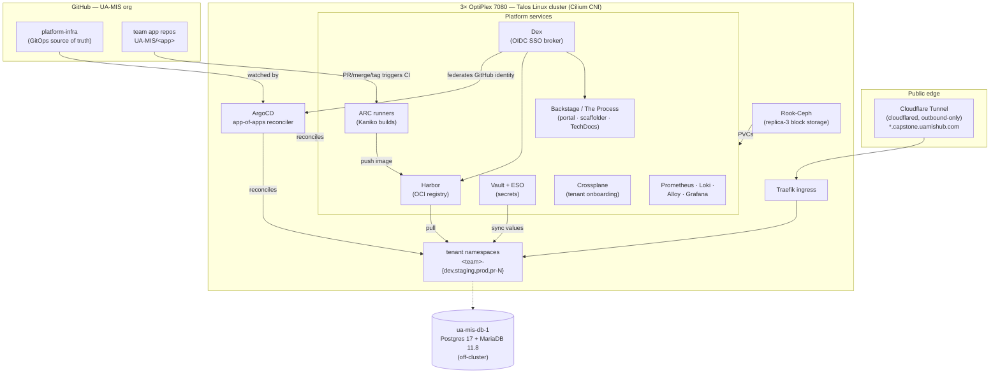

# UA-MIS Capstone IDP — Platform Overview

This is the **Internal Developer Platform (IDP)** for University of Alabama MIS capstone teams:
the self-service infrastructure on which student teams build, deploy, and run their capstone
applications — the same way an industry platform team serves product teams.

A capstone team gets, with **no cluster access and no `kubectl`**:

- A **git-driven deploy pipeline** — push code → CI builds an image → ArgoCD deploys it.
- **Four environments** per app: **preview** (per-PR), **dev**, **staging**, **prod** — with a
  click-to-approve gate in front of prod.
- **Single sign-on** with their GitHub identity (UA-MIS org membership) across every tool.
- **Isolation** — their own namespaces, quotas, RBAC, enforced network policy, and registry
  project. One team cannot see or touch another's workloads.
- A **stable URL** for each app.

!!! tip "New here?"
    If you're on a capstone team and want to ship your app, jump straight to the
    [Developer Guide → Getting started](developer/getting-started.md). This page is the big
    picture — how the platform is built and why. Operators inheriting the platform should also
    read the [Operations & handoff manual](OPERATIONS-AND-HANDOFF.md) and the Operator Guide.

## Two halves of the platform

The single most important mental model:

| Half | Who owns it | Where it lives |
| --- | --- | --- |
| **Platform** | the platform admin / SRE | `UA-MIS/platform-infra` — the single source of truth |
| **Apps** | each student team | `UA-MIS/<app-name>` repos (a `.devops/` contract wires them in) |

**ArgoCD continuously reconciles the cluster to match `platform-infra`.** You change the
platform by **merging a PR to that repo, not by running `kubectl`**. That discipline (GitOps) is
what makes the whole thing reproducible and recoverable.

## Architecture at a glance



**Deploy flow (a student ships code):** PR/merge/tag in the app repo → CI on an in-cluster
**ARC runner** builds the image **rootless with Kaniko** and pushes to the team's **Harbor**
project → the pipeline bumps the image tag in the app's `.devops/` overlay → **ArgoCD** sees the
change and reconciles the team's namespace to the new image. Non-prod tracks automatically;
**prod is pinned to an immutable `vX.Y.Z` tag and only moves after a manual Approve**.

**Login flow (SSO):** any tool → **Dex** → **GitHub** confirms UA-MIS org membership and team →
Dex issues group claims (`UA-MIS:<team>`) → the tool maps the group to a scoped RBAC role. One
GitHub OAuth/App backs everything.

## What each component is, and why

| Layer | Component | What it does · why it's here |
| --- | --- | --- |
| Node OS / k8s | **Talos Linux** (v1.13.4 / k8s v1.31.5) | Immutable, API-only node OS (no SSH/shell) on 3× converged OptiPlex 7080. Reproducible, secure-by-default, tag-efficient. Scales by **adding boxes**, not upgrading them. |
| CNI | **Cilium** (1.17.4) | eBPF dataplane with kube-proxy replacement and **enforced NetworkPolicy** — the basis of per-tenant isolation. (`bpf.hostLegacyRouting=true` keeps it compatible with the Tailscale overlay.) |
| Storage | **Rook-Ceph** (chart v1.19.7, Ceph v20.2.1) | Replica-3 block storage; `ceph-block` is the default StorageClass. A PVC survives losing one node. |
| GitOps | **ArgoCD** (app-of-apps) | Reconciles the entire platform from `platform-infra`. One root app → child apps → platform services + tenants. The reconciliation engine and the audit ledger. |
| Registry | **Harbor** | Per-team OCI image registry with OIDC SSO, Trivy scan-on-push, and least-privilege per-team push/pull robots. Where every built image lives. |
| SSO broker | **Dex** | One OIDC broker federating **GitHub-org (UA-MIS)** membership/teams as the sole identity. Every tool logs in through it. |
| CI runners | **ARC** (gha-runner-scale-set v0.14.x) | Self-hosted GitHub Actions runners as autoscaling pods; **rootless Kaniko** builds (no Docker socket, `containerMode: kubernetes`). No GitHub-hosted minutes. |
| Secrets | **Vault + External Secrets Operator** | "**Nothing in git**": values live in Vault at `tenants/<team>/<env>/app`; ESO syncs them into Kubernetes Secrets at runtime. Repos reference secrets by **name only**. Vault has Transit auto-unseal + Raft-snapshot DR. |
| Developer portal | **Backstage** ("The Process") | The student-facing front door: software **catalog**, the **scaffolder** ("New Capstone Project"), **TechDocs** (this site), and the **Secrets UI**. Dex sign-in; catalog ingested from the UA-MIS org. |
| Onboarding | **Crossplane** (ADR-031) | Zero-touch tenant provisioning: one `CapstoneTenant` claim expands (via a reviewed-once Composition + providers for GitHub/Harbor/Vault/Kubernetes) into the whole tenant. *Merged into platform-infra; the scaffolder cutover to it is staged — see below.* |
| Observability | **Prometheus + Loki + Alloy + Grafana** | kube-prometheus-stack (metrics + alerts), Loki (logs, single-binary), Alloy (collection), Grafana (dashboards). Platform alerts ship out of the box. |
| Ingress / edge | **Traefik** + **Cloudflare Tunnel** (`cloudflared`) | Traefik does host-header routing in-cluster; cloudflared gives outbound-only public reachability for `*.capstone.uamishub.com` (no inbound ports). |
| Overlay | **Tailscale** | The network fabric — stable `100.x` addressing across apartment/campus, independent of the underlying DHCP network. |
| Data tier | **PostgreSQL 17 + MariaDB 11.8** (`ua-mis-db-1`) | Off-cluster shared multi-tenant relational DB (one DB + role per team). |

## The GitOps core: app-of-apps

ArgoCD bootstraps the whole platform from a single root Application:

```
bootstrap/ (applied once by `make bootstrap`)
  └─ root app-of-apps
       ├─ platform-services/*   → Harbor, Dex, Vault/ESO, Backstage, Crossplane,
       │                          observability, ARC, Rook-Ceph, Traefik, cert-manager …
       └─ tenants/*             → per-team namespaces, AppProjects, RBAC, quotas,
                                  NetworkPolicies, and the env + preview ApplicationSets
```

Almost everything is GitOps-reconciled and self-healing. A small number of objects are
**install-owned by design** (the ArgoCD install itself and the `platform` AppProject) — they're
applied with `make bootstrap` / `make bootstrap-reapply`, not reconciled, because they're the
chicken-and-egg root ArgoCD runs on. See the [Operator Guide → ArgoCD & GitOps](operator/argocd-gitops.md).

## How a team is onboarded

A student opens **The Process → New Capstone Project**, fills four fields, and the scaffolder:

1. Creates `UA-MIS/<app>` — a repo pre-wired with the `.devops/` contract and CI.
2. Creates the team's **Harbor project** so the first build can push.
3. Registers the app in the **catalog**.
4. Opens a **review-gated onboarding PR** to `platform-infra` that, when a reviewer **merges**
   it, stands up the team's namespaces/RBAC/quotas.

That merge is the **grant**: a student can *request* cluster access; only a reviewer's merge
*grants* it. The platform's direction (ADR-031, **Crossplane**) is to make this **fully
automatic** — the scaffolder emits one `CapstoneTenant` claim and a Composition provisions the
repo wiring, Harbor, Vault, and the k8s tenancy fence with no PR and no manual operator steps.
The Crossplane machinery is merged into `platform-infra`; the scaffolder cutover is **staged**
behind installing it and proving a hand-applied claim end-to-end. See
[Operator Guide → Crossplane onboarding](operator/crossplane-onboarding.md).

## The deploy model in one table

| Git action | Environment | Image tag | Gate |
| --- | --- | --- | --- |
| Open a PR | preview (`<app>.pr-N.…`) | `pull-<sha>` | auto; torn down on close |
| Merge to `main` | dev (`<app>.dev.…`) | `git-describe` (readable) | auto |
| Push tag `vX.Y.Z` | staging (`<app>.staging.…`) | semver (immutable) | auto |
| Push tag `vX.Y.Z` | prod (`<app>.…`) | semver (immutable) | **manual approve** |

The pipeline is a **central reusable workflow** (`tenant-build.yaml@v1`) every team references, so
a CI fix ships once and reaches every tenant. See [Developer Guide → CI/CD](developer/cicd.md).

## The single most important convention: one slug everywhere

A team's identifier is **one kebab-case slug** (`<team>`) used identically as the GitHub Team
slug, the Dex OIDC group suffix (`UA-MIS:<team>`), the ArgoCD AppProject name, the namespace
prefix (`<team>-dev` / `-staging` / `-prod` / `-pr-N`), the Harbor project, and the Vault path.
ArgoCD RBAC matches `<project>/<app>`, so any divergence silently breaks a team's scoped role.
The app name is a separate slug and is globally unique (it's the repo name and the URL label).

## Continuance — the thing that must not be lost

A capstone platform must survive the graduation of the student who built it. The failure mode is
not technical — it's that the **keys to the kingdom** (the Talos `age` key, the sealing key, the
kubeconfig, and ownership of the GitHub org, Tailscale tailnet, Cloudflare, DigitalOcean, and the
domain) are tied to a personal account that disappears. **Every one of these must be
institutionally owned before the builder leaves.** This is covered in full in the
[Operations & handoff manual](OPERATIONS-AND-HANDOFF.md) (§5, CONTINUANCE) — read it first if you
are inheriting the platform.

## Where to go next

- **Building an app?** → [Developer Guide → Getting started](developer/getting-started.md)
- **Running the platform?** → the Operator Guide (Vault & DR, ArgoCD & GitOps, Harbor,
  Secrets/ESO, Crossplane onboarding, Observability, Runbooks, Gotchas & lessons) and the
  [Operations & handoff manual](OPERATIONS-AND-HANDOFF.md)
- **Substrate procedures?** → the [Phase 4 (Talos)](phase-4-runbook.md),
  [Cilium CNI](cilium-cni-runbook.md), and [DB tier](db-tier-runbook.md) runbooks
